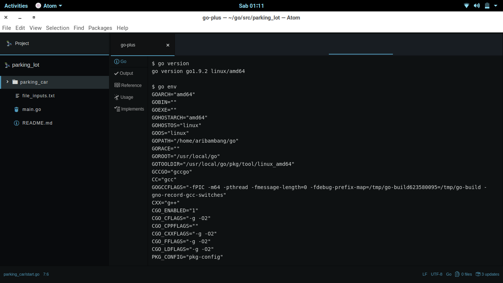
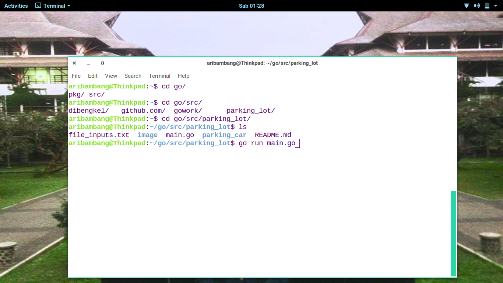

# Parking Lot Automation - Code test Mapan internship program
Parking write in Go for code test Mapan program internship

## Getting Started

These instructions will get you a copy of the project up and running on Linux, how to run and see the results.

### Prerequisites

The only prerequisite to run this project is a Linux with Go installed in it. I used Zorin OS based on Ubuntu Linux and Go v1.9.2.  

### Structure project
1. main.go is main program  
2. file_inputs.txt is sample input for file based input type)
3. parking_car package contains  
Go files: 
 1. input_command.go is contains logic for the command input.
 2. file_command.go is contains logic for file input.
 3. car.go is data type for car.

### How to run
1) Open Terminal 
2) Navigate to directory project  
3) Run go run main.go and enter the appropriate input  

